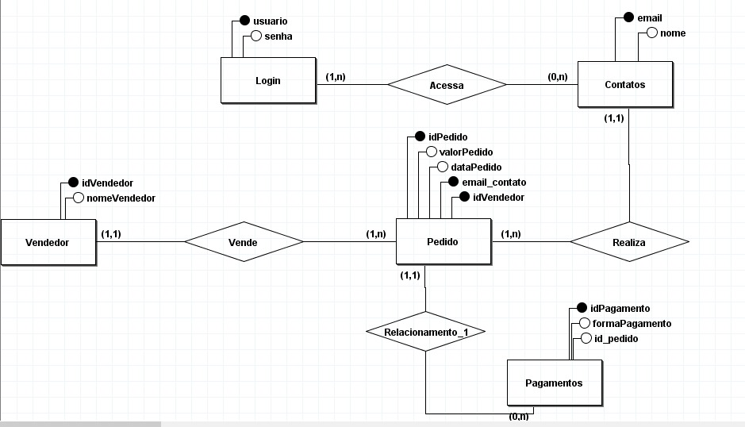
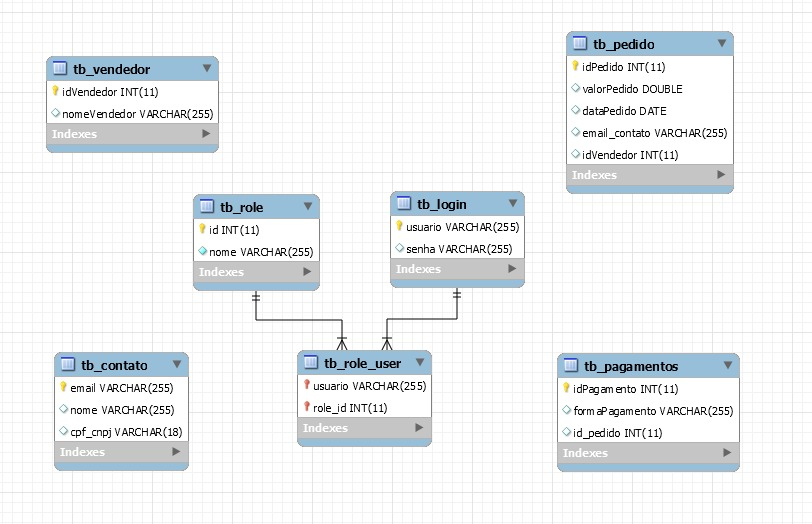

# Modelagem do Banco de Dados

## Visão Geral

O banco de dados do projeto CRM é composto por várias tabelas que armazenam informações relacionadas a contatos, login, pedidos, pagamentos e vendedores.

## Tabelas

### Tabela `tb_contato`

Armazena informações sobre contatos.

| Campo  | Tipo        | Chave Primária | Descrição                              |
|--------|-------------|----------------|----------------------------------------|
| email  | VARCHAR(255)| Sim            | Endereço de e-mail do contato.         |
| nome   | VARCHAR(255)| Não            | Nome do contato.                       |

### Tabela `tb_login`

Registra dados de login.

| Campo   | Tipo        | Chave Primária | Descrição                              |
|---------|-------------|----------------|----------------------------------------|
| usuario | VARCHAR(255)| Sim            | Nome de usuário para login.            |
| senha   | VARCHAR(255)| Não            | Senha associada ao usuário.            |

### Tabela `tb_pedido`

Contém informações sobre pedidos.

| Campo          | Tipo          | Chave Primária | Descrição                                           |
|----------------|---------------|----------------|-----------------------------------------------------|
| idPedido       | INT           | Sim            | Identificador único do pedido (autoincremento).      |
| valorPedido    | DOUBLE        | Não            | Valor do pedido.                                    |
| dataPedido     | DATE          | Não            | Data do pedido.                                     |
| email_contato  | VARCHAR(255)  | Não            | E-mail do cliente associado ao pedido.              |
| idVendedor     | INT           | Não            | Identificador único do vendedor associado ao pedido. |

### Tabela `tb_pagamentos`

Registra informações sobre pagamentos associados aos pedidos.

| Campo           | Tipo        | Chave Primária | Descrição                                       |
|-----------------|-------------|----------------|-------------------------------------------------|
| idPagamento     | INT         | Sim            | Identificador único do pagamento (autoincremento).|
| formaPagamento  | VARCHAR(255)| Não            | Forma de pagamento utilizada.                     |
| id_pedido       | INT         | Não            | Identificador único do pedido associado ao pagamento.|

### Tabela `tb_vendedor`

Armazena dados dos vendedores.

| Campo        | Tipo        | Chave Primária | Descrição                            |
|--------------|-------------|----------------|--------------------------------------|
| idVendedor   | INT         | Sim            | Identificador único do vendedor (autoincremento). |
| nomeVendedor | VARCHAR(255)| Não            | Nome do vendedor.                    |

## Diagrama Entidade-Relacionamento

## Diagrama Relacional

Esperamos que esta documentação ajude a entender a estrutura do banco de dados do projeto CRM.